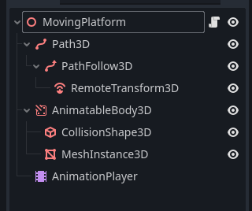
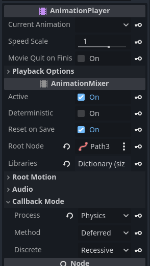

# Moving platform

## Introduction

A moving platform scene that uses a `Path3D` and a `Path3DFollow` to move an `AnimatableBody3D` along a path of points.

(Work in progress)

## Description

The scene is composed as shown in the picture below:



The `RemoveTransform3D` node must point to the `AnimatableBody3D` in the Remote Path property.

To move the collision shape with the platform, the `AnimationPlayer` must be set to `Physics` process callback mode.



## Code

```
extends Node3D
class_name MovingPlatform

@export_category("Path")
@export var path: Curve3D
@export var path_rotation_mode: PathFollow3D.RotationMode

@export_category("Animation")
@export var autoplay_animation: String = "move_platform"
@export var speed_scale: float = 1

@export_category("Platform collision")

@export var shape: Shape3D
@export var mesh: Mesh
@export_flags_3d_physics var collision_layer

# -----------
@onready var path_3d: Path3D = $Path3D
@onready var path_follow_3d: PathFollow3D = $Path3D/PathFollow3D
@onready var animation_player: AnimationPlayer = $AnimationPlayer
@onready var animatable_body_3d: AnimatableBody3D = $AnimatableBody3D
@onready var collision_shape_3d: CollisionShape3D = $AnimatableBody3D/CollisionShape3D
@onready var mesh_instance_3d: MeshInstance3D = $AnimatableBody3D/MeshInstance3D
@onready var remote_transform_3d: RemoteTransform3D = $Path3D/PathFollow3D/RemoteTransform3D


func _ready() -> void:
	# Curve path
	path_3d.curve = path
	if path_rotation_mode:
		path_follow_3d.rotation_mode = path_rotation_mode
	
	# Animation player
	animation_player.autoplay = autoplay_animation
	animation_player.callback_mode_process = AnimationMixer.ANIMATION_CALLBACK_MODE_PROCESS_PHYSICS
	animation_player.speed_scale = speed_scale
	
	# Collision layer
	animatable_body_3d.collision_layer = collision_layer
	
	# Platform collision & mesh
	if shape:
		collision_shape_3d.shape = shape
	if mesh:
		mesh_instance_3d.mesh = mesh

```